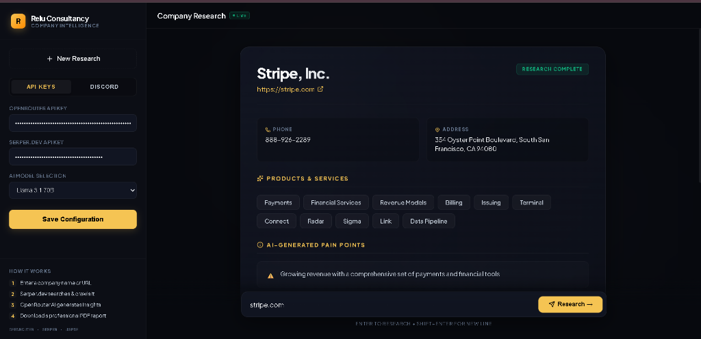
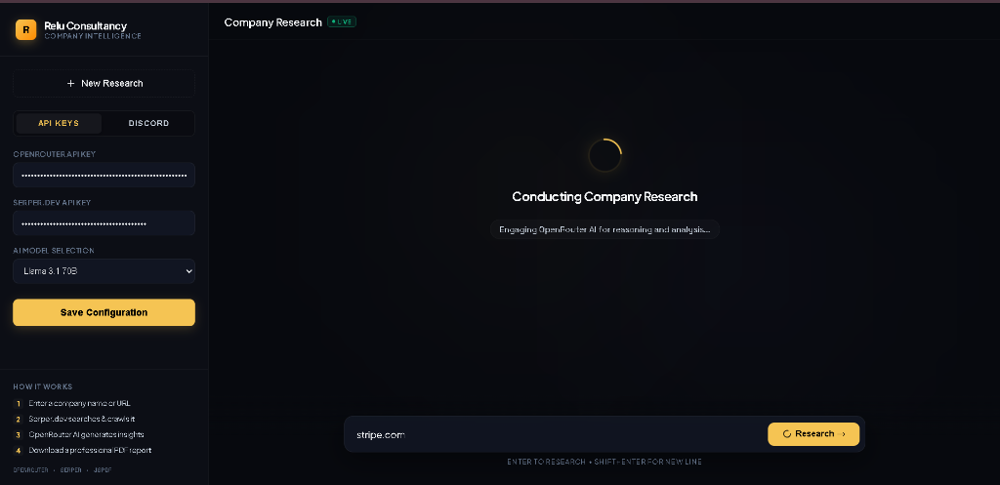
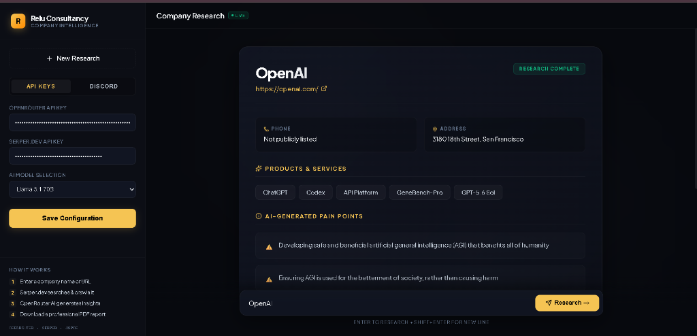
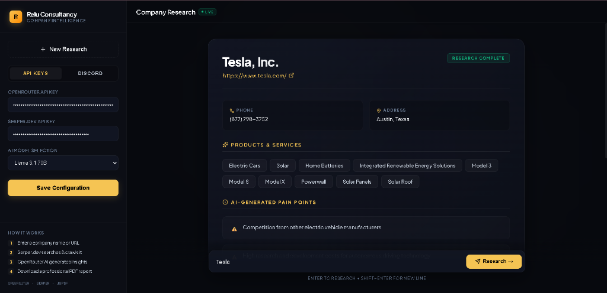

# Relu Company Intelligence Assistant 📊

An AI-powered Company Research Assistant that enables users to research any company by providing either the company name or its website URL. The application automatically crawls the target website, searches the web via Serper.dev, analyzes facts via OpenRouter/Groq API, and produces downloadable PDF reports.

[](https://hackathon-sandy-two.vercel.app/)
[](https://nextjs.org/)
[](LICENSE)

🔗 **Live Production Demo**: [hackathon-sandy-two.vercel.app](https://hackathon-sandy-two.vercel.app/)

---

## 🗺️ Quick Navigation (Interactive)
* [📁 Interactive Workspace Code Map](#-interactive-workspace-code-map)
* [📥 Download Sample Output Report](#-download-sample-output-report)
* [🎨 Premium UI Showcase](#-ui-showcase)
* [⚡ Interactive Setup & Launch checklist](#-interactive-setup--launch-checklist)
* [🚀 Features Overview](#-features-overview)
* [🛠️ Technical Stack & Libraries](#-technical-stack--libraries)
* [⚙️ Configuration Parameters](#-configuration-parameters)
* [📖 Collapsible Documentation & Guides](#-collapsible-documentation--guides)

---

## 📁 Interactive Workspace Code Map
Interact directly with the codebase files within your IDE or editor:
* 🌐 **Front-end client page**: [src/app/page.tsx](file:///d:/AiCrawler/src/app/page.tsx)
* 🎨 **Global stylesheet (Glassmorphic Redesign)**: [src/app/globals.css](file:///d:/AiCrawler/src/app/globals.css)
* ⚙️ **Next.js configuration**: [next.config.ts](file:///d:/AiCrawler/next.config.ts)
* 🧠 **Company research API endpoint**: [src/app/api/research/route.ts](file:///d:/AiCrawler/src/app/api/research/route.ts)
* 💬 **Discord webhook webhook routing endpoint**: [src/app/api/discord/route.ts](file:///d:/AiCrawler/src/app/api/discord/route.ts)

---

## 📥 Download Sample Output Report
📄 **View Sample output**: [Stripe, Inc. Research Report PDF](public/stripe_research_report.pdf)

---

## 🎨 UI Showcase

<details open>
<summary><b>📷 Click to Expand/Collapse Screenshots</b></summary>
<br />

#### 1. Premium Glassmorphic Dashboard (Stripe Research Complete)


#### 2. Conducting Company Research (Loading State with Ambient Glow Orbs)


#### 3. OpenAI Research Dashboard


#### 4. Tesla Research Dashboard


</details>

---

## ⚡ Interactive Setup & Launch Checklist
Mark your progress as you configure the application locally:
- [ ] **Clone/Unpack Workspace**: Navigate into the root folder `cd AiCrawler`
- [ ] **Install Dependencies**: Execute `npm install`
- [ ] **Set Server Fallback Keys**: (Optional) Populate `GROQ_API_KEY` in `.env.local` to trigger server-side fallback
- [ ] **Start Development Server**: Run `npm run dev`
- [ ] **Access UI**: Open [http://localhost:3000](http://localhost:3000)

---

## 🚀 Features Overview
- **ChatGPT-Style Layout**: Sleek, fully responsive dark-themed user interface with glowing ambient backgrounds.
- **Search-Enriched Crawling**: Uses Serper.dev to find official sites (if only names are supplied) and fetches contact coordinates.
- **Website Crawler**: In-memory HTML parser utilizing `cheerio` that dynamically extracts clean textual contents from Home, About, Contact, Services, and Pricing sections.
- **OpenRouter & Groq AI Engine**: Features built-in automatic failover! If your OpenRouter API key fails or expires, the backend automatically retries the prompt using the server's Groq fallback key.
- **Client-Side jsPDF Output**: Instant vector PDF compiler with custom headers, styled lists, and details.
- **Discord Bot Webhook**: Delivers PDF attachments along with applicant coordinates, company name, and website to a target Discord channel.

---

## 🛠️ Technical Stack & Libraries
- **Framework**: Next.js 16+ (App Router)
- **Styling**: Vanilla CSS (Modern CSS properties, blur-filters, custom animations)
- **Libraries**:
  - `cheerio` (In-memory web crawler)
  - `jspdf` (Client-side report compilation)
  - `lucide-react` (UI icons)

---

## ⚙️ Configuration Parameters
The application is fully client-managed via the configuration panels in the Sidebar (stored securely in `localStorage` for safety). No central database setup is required:
- **OpenRouter API Key** (`openrouterKey`): Found in OpenRouter dashboard.
- **Serper.dev API Key** (`serperKey`): Found in Serper.dev dashboard.
- **Discord Bot Token** (`botToken`): Provided by Discord developer portal.
- **Discord Channel ID** (`channelId`): Target text channel ID.
- **Applicant Details**: Name and Email address.

---

## 📖 Collapsible Documentation & Guides

<details>
<summary><b>🌐 API Endpoints & Structured Payloads</b></summary>
<br />

### 1. Research API `/api/research`
- **Method**: `POST`
- **Request Body**:
  ```json
  {
    "query": "stripe.com",
    "openrouterKey": "sk-or-v1-...",
    "serperKey": "...",
    "model": "google/gemini-2.5-flash"
  }
  ```
- **Response Schema**:
  ```json
  {
    "companyName": "Stripe, Inc.",
    "website": "https://stripe.com",
    "phone": "888-926-2289",
    "address": "San Francisco, CA",
    "productsServices": ["Payments", "Billing", "Terminal"],
    "painPoints": ["Complex payments scaling", "International billing overhead"],
    "competitors": [{"name": "PayPal", "website": "paypal.com"}]
  }
  ```

### 2. Discord Dispatch API `/api/discord`
- **Method**: `POST`
- **Request Body**:
  ```json
  {
    "botToken": "...",
    "channelId": "...",
    "applicantName": "Danish Nawaz",
    "applicantEmail": "danish@example.com",
    "companyName": "Stripe, Inc.",
    "pdfBase64": "..."
  }
  ```

</details>

<details>
<summary><b>🤖 Step-by-Step Discord Webhook Setup Guide</b></summary>
<br />

1. Go to the [Discord Developer Portal](https://discord.com/developers/applications).
2. Click **New Application** and give your bot a name.
3. Select **Bot** from the left menu and click **Add Bot**.
4. Scroll to **Privileged Gateway Intents** and enable **Message Content Intent**.
5. Copy your **Bot Token** and paste it into the Discord settings panel in the app sidebar.
6. In Discord, right-click on the target text channel and click **Copy Channel ID** (requires Developer Mode enabled in Discord Settings -> Advanced).
7. Input the Channel ID in the app sidebar settings.
8. Add your Bot to the server using the OAuth2 URL Generator with `send_messages` and `attach_files` permissions.

</details>

<details>
<summary><b>⚠️ Troubleshooting & Smart Failovers</b></summary>
<br />

- **OpenRouter Key Expired / Invalid?**
  No worries! The backend includes a smart failover: if your client-side OpenRouter key is empty or fails, it automatically detects and retries the request using the `GROQ_API_KEY` defined in the server-side environment.
- **Credit Limit / Token Limit Issues?**
  Free accounts on OpenRouter restrict requests over 16,000 tokens. The app strictly enforces `max_tokens: 2000` on LLM completions, keeping your credit usage well within free allowances.

</details>
